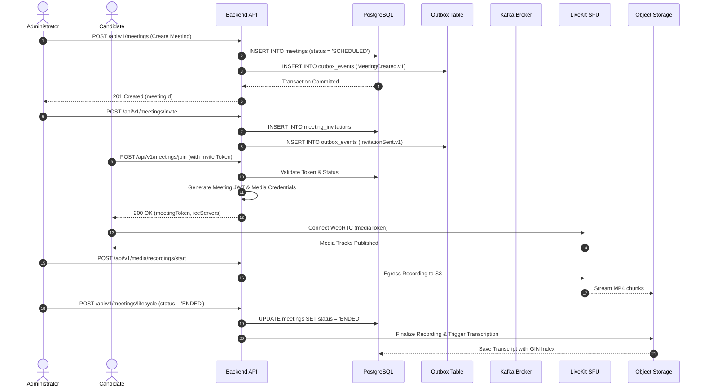

# System Architecture & Boundary Specification

## 1. High-Level Architectural Topology

The platform provides a Google Meet-style enterprise technical collaboration environment. The architecture strictly decouples the **Control Plane** (HTTP APIs, authentication, lifecycle management, chat, and outbox event streaming) from the **Media Plane** (low-latency WebRTC RTP audio, video, and screen sharing).

```mermaid
graph TD
    subgraph ClientLayer [Client Layer]
        Browser["Modern Browser (WebRTC / HTML5)"]
    end

    subgraph EdgeRouting [Edge & Routing Layer]
        VercelCDN["Vercel Global CDN (Static Assets & Stateless APIs)"]
        ReverseProxy["Reverse Proxy / API Gateway (NGINX / Cloudflare)"]
    end

    subgraph ControlPlane [Control Plane (Application Monolith)]
        AppBackend["Modular Monolith Backend (Node.js 22 + TypeScript)"]
        SocketSignaling["Socket.IO Signaling & Realtime Layer"]
        OutboxWorker["Transactional Outbox Poller"]
    end

    subgraph MediaPlane [Media Plane (Realtime SFU)]
        LiveKitSFU["LiveKit SFU (Selective Forwarding Unit)"]
        TURN["Coturn / STUN / TURN Server"]
    end

    subgraph DataTier [Storage & Event Tier]
        PostgreSQL[("PostgreSQL 15 (Authoritative Source of Truth)")]
        Redis[("Redis 7 (Presence, Rate Limiting, Ephemeral State)")]
        Kafka[("Apache Kafka (Asynchronous Event Bus & DLQ)")]
        S3Storage[("Private Object Storage (Recordings & STT Audio)")]
    end

    Browser -->|"HTTPS / REST API"| VercelCDN
    Browser -->|"Persistent WebSocket"| ReverseProxy
    Browser -->|"WebRTC RTP Media"| LiveKitSFU

    VercelCDN -->|"API Requests"| AppBackend
    ReverseProxy -->|"Proxy /api/socket"| SocketSignaling

    AppBackend -->|"ACID Transactions"| PostgreSQL
    AppBackend -->|"Outbox Poller"| OutboxWorker
    OutboxWorker -->|"Asynchronous Events"| Kafka
    AppBackend -->|"Rate Limit & Presence"| Redis
    SocketSignaling -->|"Redis Pub/Sub Adapter"| Redis

    LiveKitSFU -->|"ICE Candidates"| TURN
    LiveKitSFU -->|"Recording Finalization"| S3Storage
    AppBackend -->|"Presigned Byte-Range Stream"| S3Storage
```

---

## 2. Strict Plane Separation Boundaries

### 2.1 Control Plane
- **Responsibilities**: Authentication, RBAC, meeting scheduling, participant invitations, lifecycle state transitions, chat persistence, notifications, compliance audit logs, operational telemetry.
- **Protocols**: HTTPS (REST API), WebSockets (Socket.IO).
- **Security Boundary**: Every endpoint enforces timing-safe HMAC-SHA256 JWT checks. Non-admin calls to privileged endpoints return `HTTP 403 Forbidden`.

### 2.2 Media Plane
- **Responsibilities**: WebRTC peer negotiation, RTP packet forwarding, simulcast layer switching, adaptive bitrate control, audio mixing for recordings.
- **Protocols**: SRTP, DTLS, ICE (UDP/TCP).
- **Isolation Guarantee**: Zero video or audio data ever passes through PostgreSQL, Redis, or Kafka. The media plane operates with sub-200ms latency independent of backend database locks.

---

## 3. Storage Tier Responsibilities

| Tier | Role | Storage Semantics | Failure / Recovery Strategy |
| :--- | :--- | :--- | :--- |
| **PostgreSQL** | Durable Source of Truth | ACID Transactions, Foreign Keys, Append-Only Logs | Point-In-Time Recovery (PITR) via WAL archiving. |
| **Redis 7** | Ephemeral Presence & Limits | In-Memory Key-Value, Sets, Hashes, 60s TTLs | Graceful in-memory Map fallback; stale presence pruned via `allkeys-lru`. |
| **Apache Kafka** | Asynchronous Event Backbone | Immutable Log, Partitioned Topics, Consumer Groups | At-least-once delivery; Transactional Outbox prevents data loss; permanent errors to DLQ. |
| **Object Storage (S3)** | Binary Media Repository | Private Buckets, Presigned HMAC URLs (300s TTL) | Multi-part upload, range byte streaming (`206 Partial Content`), lifecycle auto-pruning. |

---

## 4. End-to-End Data Flow


