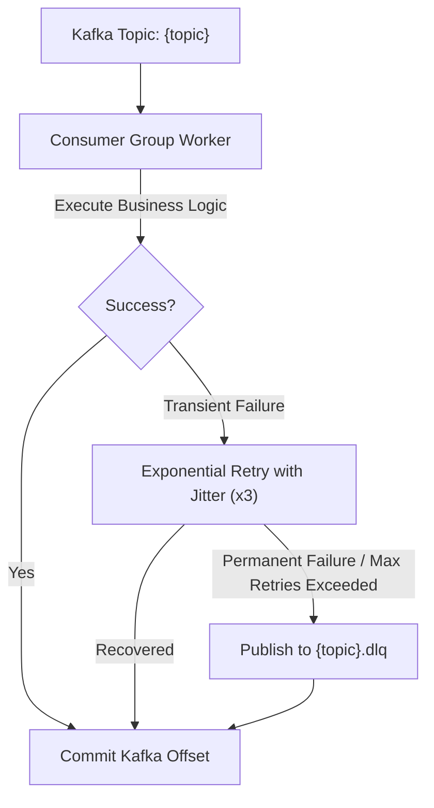

# Apache Kafka Event Catalog & Topic Inventory

## 1. Domain Topic Inventory

| Topic | Event Types | Producer | Consumer Groups | Partition Key | Retention Policy | Ordering Guarantee |
| :--- | :--- | :--- | :--- | :--- | :--- | :--- |
| **`meeting.events`** | `MeetingCreated.v1`<br>`MeetingStarted.v1`<br>`MeetingEnded.v1`<br>`MeetingCancelled.v1` | Meeting Service via Outbox | `notification-workers`<br>`audit-workers`<br>`analytics-workers` | `meetingId` | 7 Days | Strict per-meeting sequence |
| **`chat.events`** | `MessageSent.v1`<br>`MessageDeleted.v1` | Chat Service via Outbox | `chat-indexer`<br>`compliance-workers` | `conversationId` | 30 Days | Strict per-conversation sequence |
| **`notification.events`** | `NotificationRequested.v1`<br>`EmailDispatched.v1` | Outbox Dispatcher | `email-dispatch-group`<br>`push-dispatch-group` | `userId` | 3 Days | Per-user sequence |
| **`media.events`** | `RecordingStarted.v1`<br>`RecordingCompleted.v1`<br>`TranscriptGenerated.v1` | Media Recording Worker | `transcription-workers`<br>`retention-workers` | `recordingId` | 14 Days | Per-recording sequence |
| **`audit.events`** | `SecurityEvent.v1`<br>`AdminAction.v1` | Security Middleware | `security-siem-group` | `actorId` | 365 Days | Per-actor sequence |

---

## 2. Standard Event Envelope Schema (v1.0)

Every event published to Kafka is wrapped in an immutable JSON envelope:

```typescript
export interface EventEnvelope<T = unknown> {
  eventId: string;           // Globally unique UUIDv4 prefixed with "evt_"
  eventType: string;         // Fully qualified event name (e.g., "MeetingCreated.v1")
  eventVersion: string;      // Semantic schema version ("1.0")
  aggregateType: string;     // Aggregate root ("MEETING", "CHAT", "MEDIA", "USER")
  aggregateId: string;       // Unique ID of aggregate root
  occurredAt: string;        // ISO 8601 UTC timestamp
  producer: string;          // Originating service ("frontend-interview-backend")
  correlationId: string;     // W3C Traceparent / distributed correlation ID
  causationId?: string;      // ID of event/command that caused this mutation
  partitionKey: string;      // Partition key used for Kafka broker hashing
  payload: T;                // Strongly typed domain payload
}
```

---

## 3. Resilience & Dead-Letter Queue (DLQ) Architecture



1. **Transient Errors**: Network timeouts or temporary provider downtime trigger up to 3 retries with exponential backoff (e.g. 500ms, 1000ms, 2000ms) and random jitter.
2. **Permanent Errors & Poison Messages**: If unrecoverable after 3 attempts, the message envelope is published to `{topic}.dlq` with failure metadata (`errorReason`, `failedAt`, `attempts`), and the consumer offset is committed to avoid blocking healthy messages.
