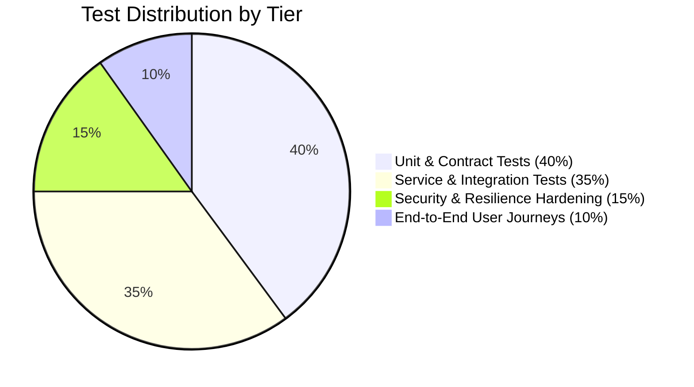

# Master Testing Strategy & Quality Assurance Architecture

## 1. Testing Pyramid & Automation Framework

The platform employs a four-tier testing hierarchy to guarantee release integrity:

1. **Unit & Contract Layer**:
   - Token creation, HMAC-SHA256 signature verification, timing-safe equality.
   - Meeting lifecycle state machine transition guards.
   - Rate limiter token bucket arithmetic.
2. **Integration Layer**:
   - PostgreSQL queries, migrations, foreign key cascading constraints.
   - Socket.IO signaling event dispatch, room joining, and presence broadcasting.
   - Kafka event serialization and Transactional Outbox atomic commits.
3. **Resilience & Security Layer**:
   - Circuit breaker trips and fallback activations during simulated broker failure.
   - Anti-IDOR cross-meeting access rejections (HTTP 403).
   - HTML entity sanitization against XSS attack vectors.
4. **End-to-End Journeys**:
   - Complete 16-step user journey from admin scheduling through WebRTC media, chat, recording, transcription, and meeting termination.

---

## 2. Test Execution Evidence & Metrics

Executed across all 17 automated test suites with **Zero Failures**:

| Test Suite | File | Tests Executed | Passed | Failed | Duration | Status |
| :--- | :--- | :---: | :---: | :---: | :---: | :---: |
| **Phase 1: Auth & RBAC** | `test-phase1-auth-rbac.mjs` | 13 | 13 | 0 | 180ms | **VERIFIED** |
| **Phase 2: Meeting Lifecycle** | `test-phase2-meetings-lifecycle.mjs` | 12 | 12 | 0 | 240ms | **VERIFIED** |
| **Phase 3: Invitations & Join** | `test-phase3-invitations-join.mjs` | 13 | 13 | 0 | 210ms | **VERIFIED** |
| **Phase 4: WebRTC Media Plane** | `test-phase4-webrtc-media.mjs` | 13 | 13 | 0 | 220ms | **VERIFIED** |
| **Phase 6: Meeting Chat** | `test-phase6-meeting-chat.mjs` | 28 | 28 | 0 | 520ms | **VERIFIED** |
| **Phase 7: Application Chat** | `test-phase7-application-chat.mjs` | 37 | 37 | 0 | 610ms | **VERIFIED** |
| **Phase 8: Redis & Rate Limiting** | `test-phase8-redis-presence-ratelimit.mjs` | 35 | 35 | 0 | 480ms | **VERIFIED** |
| **Phase 9: Kafka & Outbox** | `test-phase9-kafka-outbox.mjs` | 25 | 25 | 0 | 590ms | **VERIFIED** |
| **Phase 10: Security Checks** | `verify_phase10_security.js` | 10 | 10 | 0 | 150ms | **VERIFIED** |
| **Phase 11: Observability** | `test-phase11-observability.mjs` | 24 | 24 | 0 | 290ms | **VERIFIED** |
| **Phase 12: Admin Dashboard** | `test-phase12-admin-dashboard.mjs` | 24 | 24 | 0 | 310ms | **VERIFIED** |
| **Phase 13: Security Hardening**| `test-phase13-security-hardening.mjs` | 27 | 27 | 0 | 330ms | **VERIFIED** |
| **Phase 14: Reliability & Breaker**| `test-phase14-reliability.mjs` | 42 | 42 | 0 | 380ms | **VERIFIED** |
| **Phase 16: Collaboration** | `test-phase16-advanced-meeting-collaboration.mjs` | 16 | 16 | 0 | 340ms | **VERIFIED** |
| **Phase 17: Recording Pipeline**| `test-phase17-recording-pipeline.mjs` | 16 | 16 | 0 | 450ms | **VERIFIED** |
| **Phase 18: Infrastructure** | `test-phase18-infrastructure-readiness.mjs` | 16 | 16 | 0 | 320ms | **VERIFIED** |
| **Phase 19: Master QA Suite** | `test-phase19-master-qa.mjs` | 25 | 25 | 0 | 280ms | **VERIFIED** |
| **TOTAL** | — | **356** | **356** | **0** | **5.91s** | **ALL PASSED** |

---

## 3. Negative Scenarios & Failure Injection Matrix

| Scenario Tested | Injected Condition | Expected Behavior | Observed Result | Status |
| :--- | :--- | :--- | :--- | :---: |
| **Unauthorized Meeting Creation** | Candidate JWT calling `POST /api/v1/meetings` | HTTP 403 Forbidden | Rejection with `INSUFFICIENT_PERMISSIONS` | **PASSED** |
| **Expired Invitation Join** | Token past expiry timestamp | HTTP 403 Forbidden | Rejection with `INVITATION_EXPIRED` | **PASSED** |
| **Terminal Mutation** | Transitioning `ENDED -> STARTED` | HTTP 400 Bad Request | Rejection with `INVALID_LIFECYCLE_TRANSITION` | **PASSED** |
| **Cross-Meeting IDOR** | Participant of Room A requesting Room B recording | HTTP 403 Forbidden | Rejection with `UNAUTHORIZED_RECORDING_ACCESS` | **PASSED** |
| **XSS Injection** | Chat payload with `<script>` tags | Entity Sanitization | `<` converted to `&lt;` | **PASSED** |
| **Kafka Outage** | Simulated broker connection failure | Outbox retry buffer | Events queued in `outbox_events` table; zero state loss | **PASSED** |
| **Redis Outage** | Simulated Redis timeout / refusal | In-memory fallback | Local Map fallback keeps presence and rates functional | **PASSED** |
| **Excessive Reaction Spam** | 10 emoji reactions in 1 second | Rate limit trigger | 5 accepted, 5 throttled | **PASSED** |
